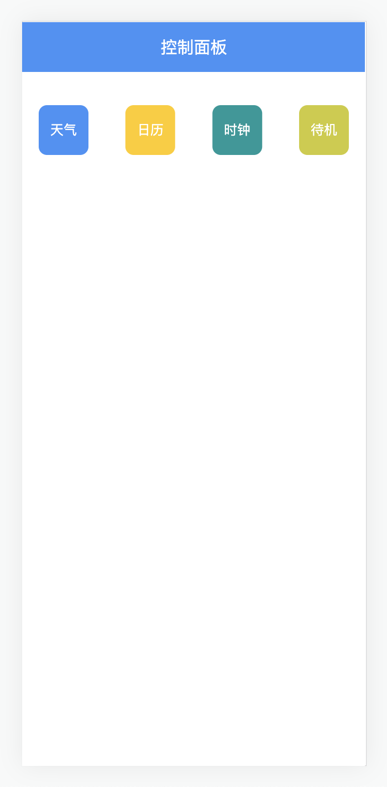

<h1 align="center">
  ESP32 电子墨水屏 Web Server
</h1>

## 特性

在 ESP32 上使用 MicroPython 驱动 2.9 吋电子墨水屏，启动一个 Web Server，实现手机端通过网页控制显示内容。

支持 4 种显示模式：天气、日历、时钟、待机。

<div align="center">
  <kbd>
    
  </kbd>
</div>

## 快速开始

1. 修改配置 `config.py`

    最小修改：
    ```python
    WIFI_SSID = "WI-FI 名称"
    WIFI_PASSWORD = "WI-FI 密码"

    # https://lbs.amap.com/api/webservice/guide/api/weatherinfo
    WEATHER_URL = "查询天气接口"
    ```

2. 通过 `Thonny` IDE 启动程序 `server.py`

3. 程序启动后会在屏幕上显示 `IP` 地址，替换 `index.html` 中的 `url` 地址

4. 浏览器地址栏输入 `IP:Port` 即可访问控制面板

## 技术栈

ESP32 + MicroPython + E-Ink

## 演示


## References

- https://github.com/mcauser/micropython-waveshare-epaper

- https://github.com/adafruit/Adafruit_CircuitPython_framebuf

- https://www.itprojects.cn
